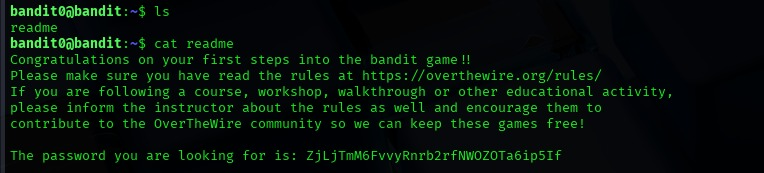

# Bandit Level 00 → Level 01

## 🎯 Objective
Connect to the Bandit server as **bandit0** and retrieve the password required to access the next level.  
The password is stored inside a file located in the home directory.

---

## 🧑‍💻 Credentials Provided
**Username:** bandit0  
**Password:** Provided by OverTheWire  

---

## 🔍 Method of Solve
After logging in, the home directory contains a file named **`readme`**.  
This file holds the password for the next level.  
By listing the directory contents and reading the file, the password can be retrieved easily.

---

## 🧪 Commands Used
- `ls`  
- `cat readme`  

---

## 📸 Bandit Level 00 Screenshot

---

## 🔑 Password for Level 01
**`ZjLjTmM6FvvyrRnbb2rfNWOZOTA6ip5If`**

---

## 🧠 Explanation
- The `ls` command confirms the presence of the `readme` file in the directory.  
- Using `cat readme` displays the content of the file, which includes the password.  
- This level demonstrates basic Linux commands used to explore directories and read files—skills required in all upcoming Bandit levels.

---

## 🔐 Concept Learned
- Basics of navigating the Linux file system  
- Reading files using terminal commands  
- Understanding simple file-based challenges in CTF environments  

---
